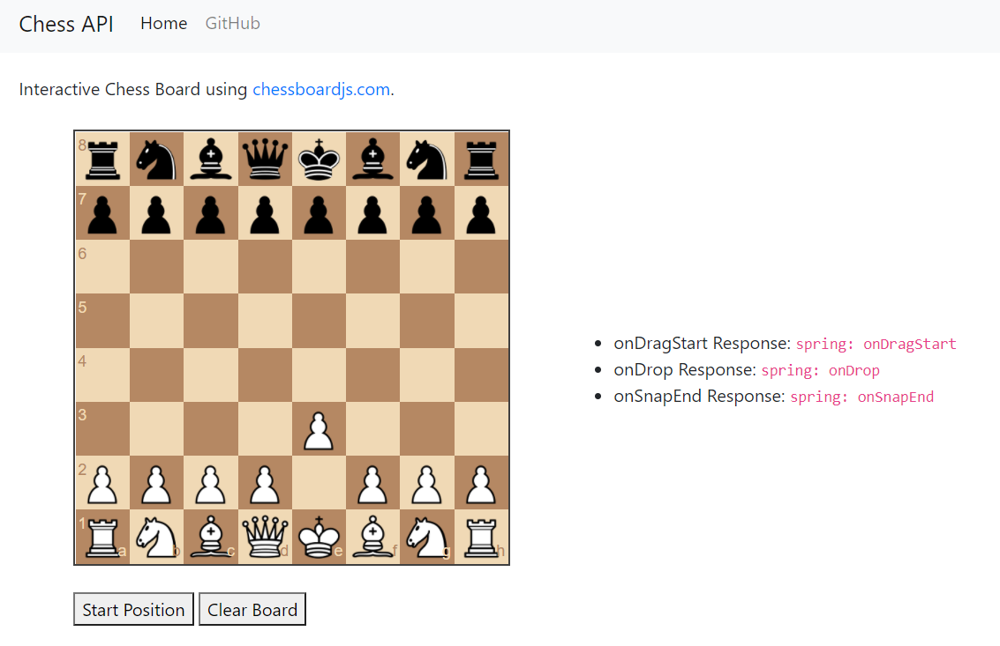

# chessapi

Java Chess API written using Spring Boot and Thymeleaf.

## Features

* Provides an ``API`` which takes PGN as input and returns the current board.
* Provides a frontend for testing out the API. Check out the very cool [chessboardjs](https://github.com/oakmac/chessboardjs/) project.



## API Tests

```bash
curl -H "Content-Type: application/json" --request POST --data "hello world" "http://localhost:8080/api/get_chess_board"
```

## Design

The wiki provides information on the programming design for the Chess logic.

See https://github.com/nathanesau/chessapi/wiki/Chess-Design.